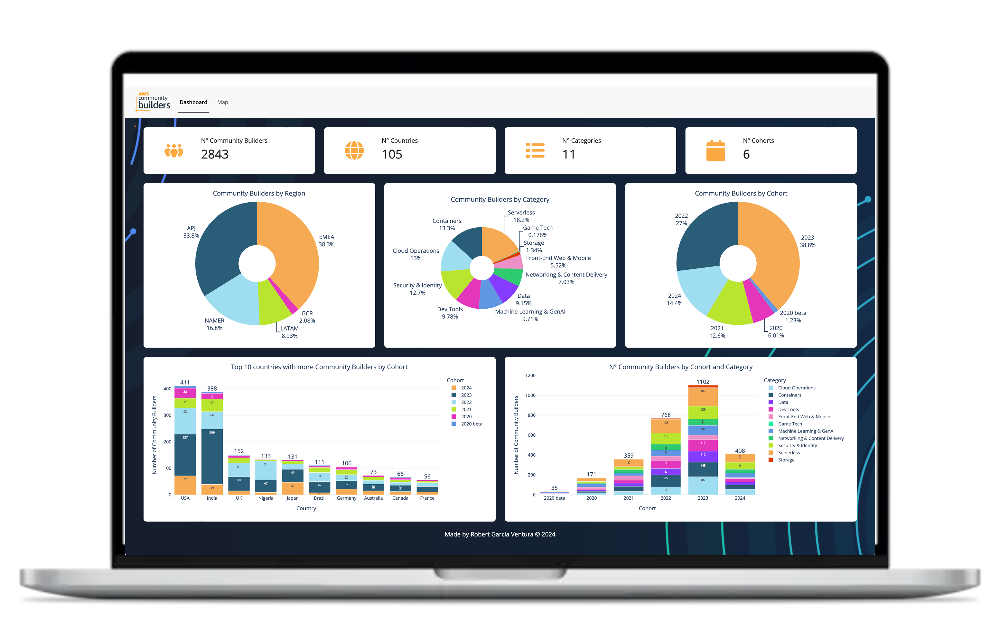

# AWS Community Builders Dashboard



Welcome to the AWS Community Builders Dashboard repository! This guide will help you install, set up, and run the dashboard on your local machine.

This dashboard will show you some statistics about the Amazon Web Services (AWS) program and how many CBs there are for each category, country and cohort.

What you can do with the dashboard:<br>
- 🌟 On the map you can click each number and it will show the country name and a pie chart with the % of community builders for each category in that country<br>
- 🌟 On the top left of the screen there is an orange arrow that opens a menu:<br>
- You can change colors of the graphs<br>
- You can change from Dark mode to White mode<br>

Some recommendations and considerations before using the dashboard:<br>
- 🔎 Zoom out (like 80%) the page to get a full overview of all graphs<br>
- 💻 Recommend to use big screen/monitor<br>
- 🗺 Map goes full screen in Safari but not in Chrome<br>
- ⏳ Map loads very slowly in Safari and in Chrome is faster<br>
- ⏲ First time to execute the dashboard it takes some time to download all files<br>

### Prerequisites

Before you begin, ensure you have the following installed on your system:

- **Python 3.8 or higher**: You can download Python from the [official website](https://www.python.org/downloads/).
- **pip**: Python's package installer, which is included with Python 3. Ensure it's updated to the latest version:
  ```sh
  python -m pip install --upgrade pip
  ```

### Installation

1. **Clone the repository**: First, clone the repository to your local machine using Git. Open your terminal or command prompt and run:
   ```sh
   git clone https://github.com/robertgv/aws-community-builders-dashboard.git
   cd aws-community-builders-dashboard
   ```

2. **Create a virtual environment**: It is recommended to create a virtual environment to manage dependencies. Run the following commands:
   ```sh
   python -m venv venv
   ```

3. **Activate the virtual environment**:
   - **Windows**:
     ```sh
     venv\Scripts\activate
     ```
   - **macOS/Linux**:
     ```sh
     source venv/bin/activate
     ```

4. **Install the required packages**: With the virtual environment activated, install the necessary dependencies using the `requirements.txt` file:
   ```sh
   pip install -r requirements.txt
   ```

### Running the Application

Once all dependencies are installed, you can run the Python Shiny application. Follow these steps:

1. **Navigate to the dashboard directory** (if not already in it):
   ```sh
   cd dashboard
   ```

2. **Run the Shiny application**:
   ```sh
   shiny run app.py
   ```

### Accessing the Application

After running the above command, the application should be running on your local server. Open your web browser and go to the following URL:
```sh
http://127.0.0.1:8000
```

You should see the AWS Community Builders Dashboard. If you need to stop the server, press `Ctrl + C` in the terminal.

### Troubleshooting

If you encounter any issues during installation or running the application, consider the following steps:

- Ensure all dependencies are installed correctly.
- Check for any syntax or import errors in your Python files.
- Verify that your virtual environment is activated.
- Consult the application's documentation or support channels.

### License

This project is licensed under the MIT License - see the [LICENSE](LICENSE) file for details.

### Contributing

We welcome contributions! Please see the [CONTRIBUTING](CONTRIBUTING.md) file for guidelines on how to get involved.

### Contact

If you have any questions or feedback, feel free to reach out:

- **LinkedIn**: [https://www.linkedin.com/in/robertgarciaventura/](https://www.linkedin.com/in/robertgarciaventura/)
- **GitHub Issues**: [https://github.com/robertgv/aws-community-builders-dashboard/issues](https://github.com/robertgv/aws-community-builders-dashboard/issues)

Hope you like it! ❤️
